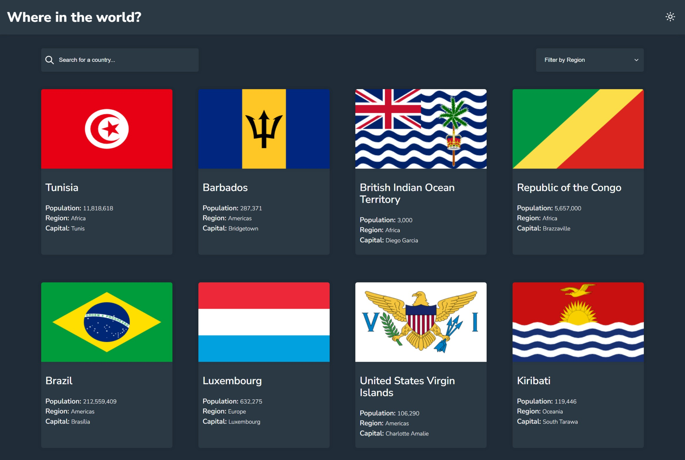
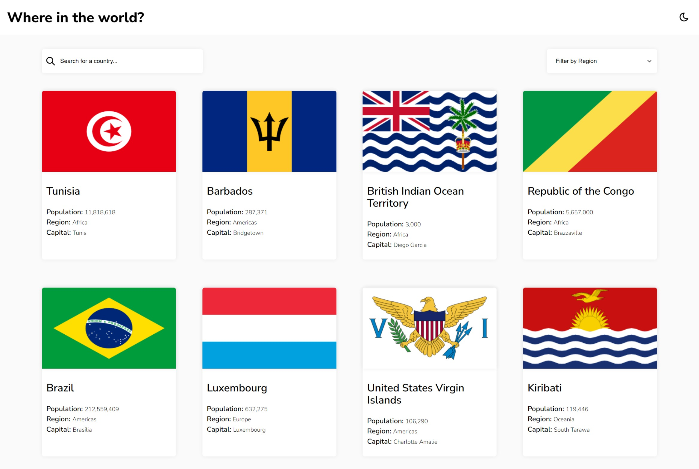
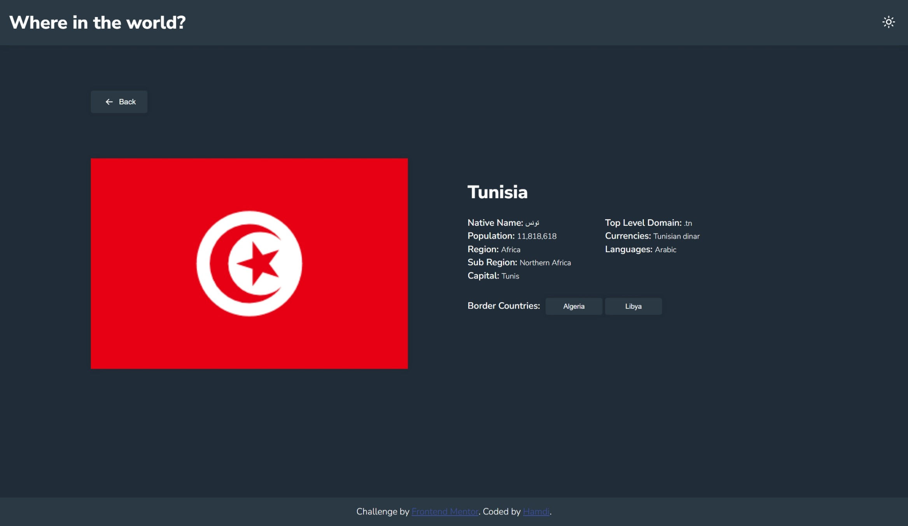
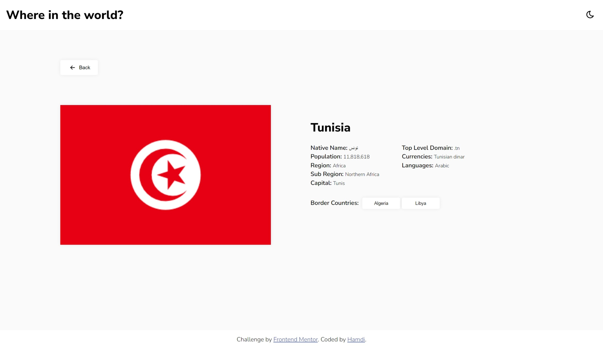
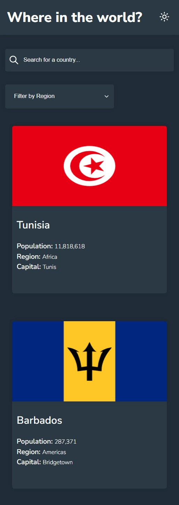
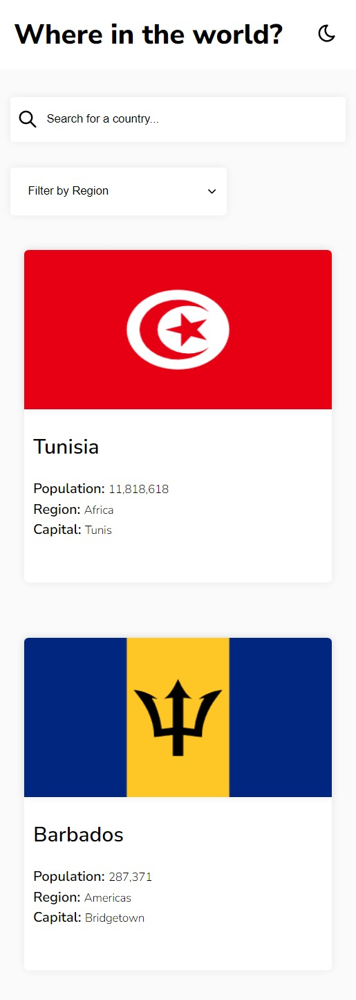
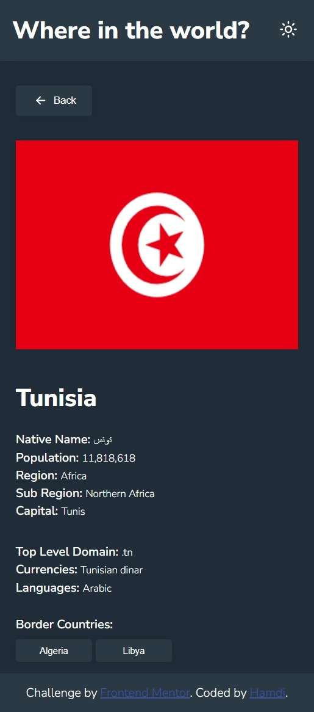
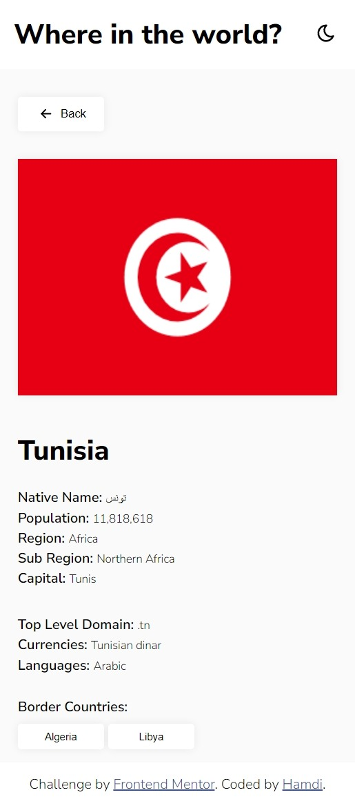

# Frontend Mentor - REST Countries API with color theme switcher solution

This is a solution to the [REST Countries API with color theme switcher challenge on Frontend Mentor](https://www.frontendmentor.io/challenges/rest-countries-api-with-color-theme-switcher-5cacc469fec04111f7b848ca). Frontend Mentor challenges help you improve your coding skills by building realistic projects.

## Table of contents

- [Overview](#overview)
  - [The challenge](#the-challenge)
  - [Screenshot](#screenshot)
  - [Links](#links)
- [My process](#my-process)
  - [Built with](#built-with)
- [Author](#author)

## Overview

### The challenge

Users should be able to:

- See all countries from the API on the homepage
- Search for a country using an `input` field
- Filter countries by region
- Click on a country to see more detailed information on a separate page
- Click through to the border countries on the detail page
- Toggle the color scheme between light and dark mode

### Screenshot

Desktop Home page - Dark mode

Desktop Home page - Light mode

Desktop Details page - Dark mode

Desktop Details page - Light mode

Mobile Home page - Dark mode

Mobile Home page - Light mode

Mobile Details page - Dark mode

Mobile Details page - Light mode

### Links

- Solution URL: [Add solution URL here](https://your-solution-url.com)
- Live Site URL: [Add live site URL here](https://your-live-site-url.com)

## My process

### Built with

- Semantic HTML5 markup
- Flexbox
- CSS Grid
- SASS
- Typescript _(partial)_
- [React](https://reactjs.org/) - JS library

## Author

- Frontend Mentor - [@justgo97](https://www.frontendmentor.io/profile/justgo97)
- Linkedin - [hamdi20](https://www.linkedin.com/in/hamdi20/)
